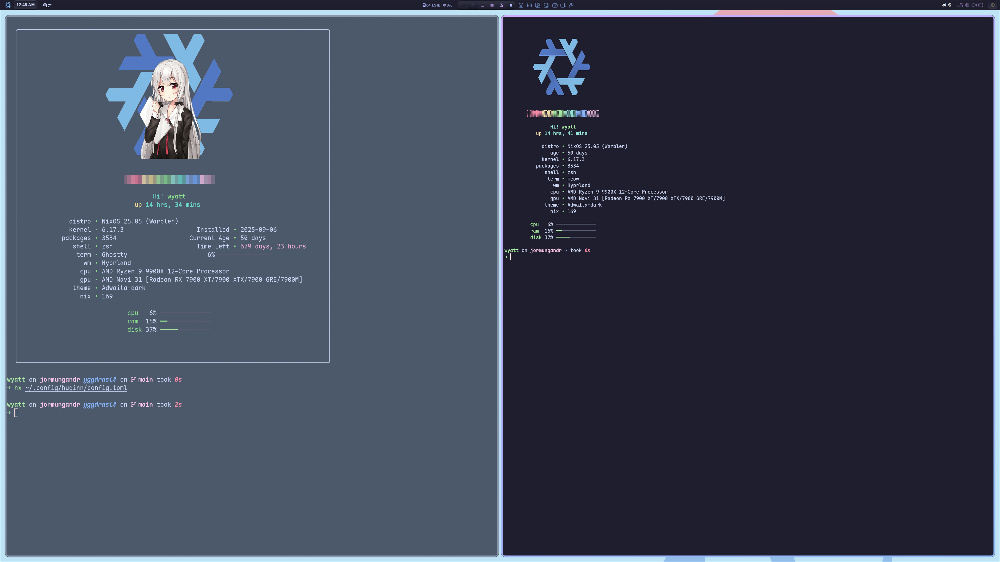

# Huginn

A beautiful, fast system information fetcher written in Rust.
Displays your system stats with distro-specific logos and a clean, colorful interface.



## Features
- **Beautiful UI** - Clean color gradient and progess bars.
- **Distro Logos** - SVG logos for popular GNU+Linux distributions
- **Fast** - written in Rust for minimal overhead
- **Multiple Terminal Protocols** - works with multiple interfaces
- **Theme-Aware** - I did my best to not just make it Catppuccin
- **Package Manager Detection** - Counts packages as best as it can regardless of package manager
- **Challenge Flag** - Track your OS challenge, default 2 years
- **System Metrics** - CPU, RAM and disk usage with progress bars

## Installation

### With Nix (Recommended)

1.  **Run without installing**:
    ```bash
    nix run git+https://codeberg.org/wyfy/huginn
    ```
    *(Note: This will show a "No Logo found" message. See the Adding Logos section.)*

2.  **Install from source**:
    ```bash
    git clone https://codeberg.org/wyfy/huginn.git
    cd huginn
    nix develop
    cargo build --release
    sudo cp target/release/huginn /usr/local/bin/
    ```
    The `nix develop` shell handles all dependencies and creates the logo directory for you.

### Without Nix

1.  **Install dependencies**:
    -   **Arch**: `sudo pacman -S rust librsvg libsixel imagemagick`
    -   **Debian/Ubuntu**: `sudo apt install cargo librsvg2-dev libsixel-dev imagemagick`
    
2.  **Build and install**:
    ```bash
    git clone https://codeberg.org/wyfy/huginn.git
    cd huginn
    cargo build --release
    sudo cp target/release/huginn /usr/local/bin/
    ```

## Adding Logos

Huginn requires you to add SVG logos to display them.

1.  **Create the logo directory**:
    ```bash
    mkdir -p ~/.local/share/huginn/logos
    ```

2.  **Add Logos**:
    -   You **must** add a generic `linux.svg` to serve as a fallback.
    -   Add logos for your specific distributions, like `nixos.svg`, `arch.svg`, etc. The filename must be the lowercase name of the distro.

## Usage/Configuration
Simply run `huginn` in your terminal. There is currently no configuration file or command-line flags.

Track your progress with the challenge countdown feature. By default, it challenges you to keep your system with the same installation for 2 years:
```bash
huginn --challenge
```

Customize the challenge duration:
```bash
huginn --challenge --years 1 --months 6
# short flags
huginn -c -y 2 -m 3
```

Challenge flag displays:
- Installation date
- Current system age
- Time remaining to reach your goal (or "Challenge Complete!" if you've made it)

## Troubleshooting

-   **"Logo not found" error**: Make sure you have created the `~/.local/share/huginn/logos` directory and added `linux.svg` and your distro's logo.
-   **No logo appears**: Your terminal may not support graphics, or you may be missing dependencies like `librsvg`.
-   **Misaligned text/logo**: Huginn is designed for standard terminal widths (80-120 columns). Try adjusting your window size or font.

## Contributing

Contributions are welcome! Feel free to submit pull requests for bug fixes, new distro logos, or other improvements. Please run `cargo fmt` to format your code before submitting.

## To-Do
- Add a configuration file
- Add custom epoch for people that reinstall but are still on the same challenge
- Add a progress bar for challenge
- Maybe center the logo and greeting when the challenge flag is invoked
